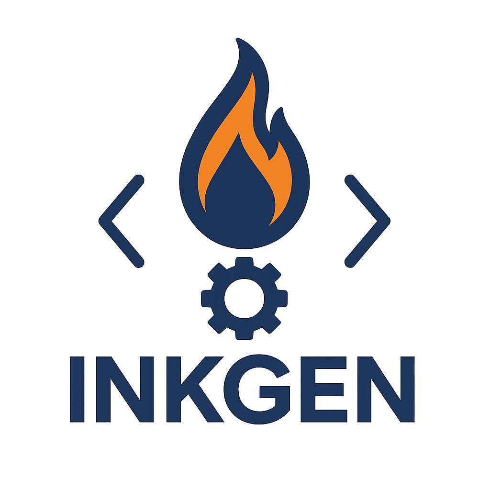
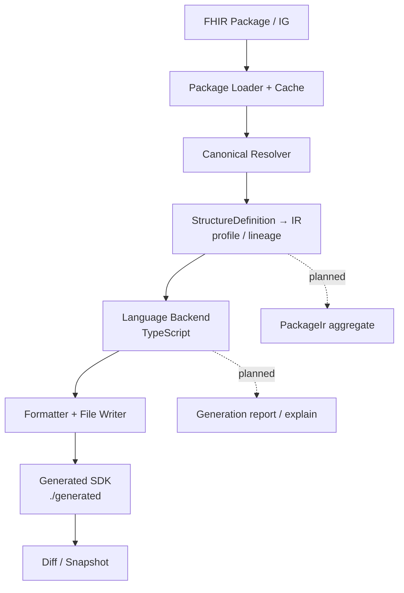

# InkGen



**A Rust-based HL7 FHIR code generator for deterministic, inspectable TypeScript SDKs — generated from FHIR packages, StructureDefinitions, profiles, and implementation guides.**

InkGen turns canonical FHIR packages into type-safe, idiomatic code. The
TypeScript backend is functional today; the core is built as a multi-language
platform so additional backends can be added without re-implementing FHIR
semantics.

> **Status:** active development. The TypeScript backend works and is tested.
> APIs may change. Early adopters and contributors welcome.

---

## Why InkGen?

- **FHIR-aware IR** — a serializable intermediate representation models slicing,
  bindings, extensions, invariants, `value[x]`, cardinality, fixed/pattern
  values, and `mustSupport`, so backends consume structure instead of re-parsing
  raw FHIR.
- **Deterministic output** — ordered with `IndexMap` and explicit sorting so
  regenerating the same input yields the same files (readable diffs).
- **Inspectable** — generated output can be diffed and snapshot-tested; richer
  `explain`/`report` tooling is on the roadmap.
- **Extensible** — a single `LanguageGenerator` trait is the backend contract.
- **Rust performance** — fast, single-binary CLI (`inkgen`).

Each claim above maps to code in `crates/`; capabilities that are not yet
implemented are listed as **Planned** in the matrix below.

---

## What works today (and what doesn't)

| Capability | Status | Notes |
|---|---|---|
| FHIR package loading & caching | ✅ Implemented | via `octofhir-canonical-manager` |
| Canonical URL resolution | ✅ Implemented | `inkgen-core` services |
| StructureDefinition → IR | ✅ Implemented | `inkgen-core/src/ir` |
| TypeScript interfaces | ✅ Implemented | incl. nested / BackboneElement types |
| TypeScript classes / builders | ✅ Implemented | `interface`, `class`, `class_with_builder` |
| ValueSet generation | ✅ Implemented | closed unions (required/extensible), open unions (preferred/example) |
| Profile classes | ✅ Implemented | extension accessors, serialization, validation |
| Zod schemas | ✅ Implemented | Zod 4 idioms (`z.iso.date()`, `z.intersection()` for profiles) |
| Branded primitives | ✅ Implemented | opt-in compile-time safety |
| Interop helpers | ✅ Implemented | typed references, date helpers, bundle traversal, search |
| Template overlays | ✅ Implemented | customize templates without forking |
| Directory diff tooling | ✅ Implemented | `inkgen diff` |
| Snapshot tests + benchmarks | ✅ Implemented | `insta`, Criterion (`just bench`) |
| Profile generation (snapshot-based) | ⚠️ Partial | relies on packaged snapshots; differential-only merge is roadmap |
| Generated TypeScript typechecks in CI | ✅ Implemented | `tsc --noEmit` gate over generated r4-core (incl. profiles) |
| Slicing / discriminators | ⚠️ Partial | modeled in IR; backend coverage evolving |
| Example Rust backend | 🧪 Experimental | `inkgen-rust` is a skeleton; `generate()` is a stub |
| `PackageIr` handed to backends | 🗺️ Planned | backends currently consume a provider |
| `inspect ir` / `explain` / report | ✅ Implemented | IR-as-JSON; `explain` shows why each field maps as it does; `--report` writes report.md + file map |
| Python / C# / other backends | 🗺️ Planned | — |
| WASM plugins | 🗺️ Planned | RFC stage |

---

## Architecture



Today, backends receive a structure-definition *provider* and build their model
from the IR on demand. A shared `PackageIr` aggregate and an explain/report
surface are planned (see [improvement plan](docs/analysis/inkgen-improvement-plan.md)).

---

## Install

```bash
# From a clone (installs the `inkgen` binary):
cargo install --path crates/inkgen-cli

# Verify your environment:
inkgen doctor
```

Prerequisites: Rust stable (edition 2024). [`just`](https://github.com/casey/just)
is optional, for the development recipes below.

---

## Quick start

```bash
inkgen config init                 # create inkgen.toml (use --force to overwrite)
inkgen fetch                       # download configured FHIR packages
inkgen generate typescript         # emit TypeScript into ./generated
```

`inkgen.toml` (created by `config init`) declares packages and TypeScript
options. The default package is `hl7.fhir.r4.core`. All TypeScript features
(profiles, ValueSets, guards, Zod, interop) are enabled by default; opt out per
option.

```toml
[[packages]]
name = "hl7.fhir.r4.core"
version = "4.0.1"

[languages.typescript]
mode = "interface"                 # interface | class | class_with_builder
naming_convention = "pascal"       # pascal | camel | snake
output_structure = "flat"          # flat | by_package
# output_dir = "generated"         # default: ./generated
branded_primitives = true
# structural_guards = false
# generate_profiles = false
# generate_valuesets = false
# zod_schemas = false
```

### Generate options

```
inkgen generate typescript [--output <dir>] [--offline] [--dry-run] [--config <path>] [--package <name>]
```

- `--output <dir>` — override the output directory (default `./generated`)
- `--offline` — require all packages to be pre-cached (no network)
- `--dry-run` — show what would be generated without writing files
- `--package <name>` — restrict to a subset of configured packages

---

## CLI commands

| Command | Purpose |
|---|---|
| `inkgen config init` | create a starter `inkgen.toml` (`--force` to overwrite) |
| `inkgen config validate` | validate the manifest |
| `inkgen config completions <shell>` | emit shell completion scripts |
| `inkgen fetch` | download & cache configured FHIR packages |
| `inkgen generate typescript` | generate the TypeScript SDK |
| `inkgen inspect ir <canonical>` | resolve a canonical URL and print its IR as JSON |
| `inkgen explain <canonical>` | explain how each element maps to generated code, and why |
| `inkgen backends` | list available code-generation backends |
| `inkgen diff --old <dir> --new <dir>` | unified diff of two output directories |
| `inkgen doctor` | check the environment & dependencies |

---

## Adding a language backend

Implement the `LanguageGenerator` trait from `inkgen-core`. Today the backend
receives a `StructureDefinitionProvider` and the package descriptor, then loads
IR (`ResourceDefinition`) per structure:

```rust
use async_trait::async_trait;
use anyhow::Result;
use inkgen_core::{LanguageGenerator, PackageDescriptor,
                  StructureDefinitionProvider, StructureProviderConfig};

pub struct MyBackend { /* config */ }

#[async_trait]
impl<S> LanguageGenerator<S> for MyBackend
where
    S: StructureDefinitionProvider + Sync + Send,
{
    async fn generate(
        &self,
        service: &S,
        descriptor: &PackageDescriptor,
        provider_config: &StructureProviderConfig,
    ) -> Result<()> {
        // list structures -> load IR -> render -> write files
        Ok(())
    }
}
```

- Reference implementation: `crates/inkgen-typescript`.
- Skeleton example: `crates/inkgen-rust` (currently a stub — illustrates the
  shape, not full generation).
- The IR you consume lives in `crates/inkgen-core/src/ir`.

See [backends docs](docs/book/src/backends/extending.md). A future `PackageIr`
contract (handing backends a fully-lowered IR) is described in the
[improvement plan](docs/analysis/inkgen-improvement-plan.md).

---

## Determinism & debugging

- **Stable ordering** — IR types sort their elements/extensions/invariants and
  the provider sorts its structure list, so output is reproducible. CI enforces
  this: it generates r4-core twice and fails if the two runs differ.
- **Verify it yourself** — `inkgen generate typescript --verify` regenerates into
  a temp dir and fails (non-zero) if the result differs from your output
  directory, without modifying it. See the
  [Determinism Contract](docs/book/src/advanced/determinism.md).
- **Snapshots** — `insta` golden tests guard generated output against drift.
- **Diff** — `inkgen diff` shows a unified diff between two output directories.
- **Inspect** — `inkgen inspect ir <canonical>` resolves a structure and prints
  its IR as JSON (logs go to stderr, so stdout pipes cleanly into `jq`).
- **Explain** — `inkgen explain <canonical> [--element <path>]` shows, per
  element, the cardinality and *why* it maps the way it does — e.g. a `code`
  field with a required binding becomes a closed union, a `value[x]` becomes a
  union of its variants. Answers "why is this field a `string` and not an enum?"
- **Report** — `inkgen generate typescript --report` writes
  `.inkgen/debug/report.md` (inputs, timing, file count/size) and
  `generated-file-map.json` (every generated file with its byte size).
- **Planned** — richer diagnostics (skipped/unsupported constructs, renamed
  symbols) require generator instrumentation. Tracked in the roadmap.

---

## Development

```bash
just bootstrap   # install rustfmt + clippy
just test        # cargo test --all
just review      # fmt --check + clippy -D warnings + tests
just bench       # Criterion benchmarks
just docs-serve  # serve the mdBook locally
```

---

## Workspace layout

```
inkgen/
├── crates/
│   ├── inkgen-cli/         # CLI (binary: `inkgen`)
│   ├── inkgen-core/        # IR, config, cache, services, traits
│   ├── inkgen-typescript/  # TypeScript backend (overlays, Zod, interop)
│   ├── inkgen-rust/        # Example Rust backend (skeleton)
│   └── inkgen-testing/     # Shared test helpers
├── docs/book/              # mdBook documentation
└── .github/workflows/      # CI, docs deploy, release
```

---

## Documentation

- [Getting Started](docs/book/src/getting-started.md)
- [Architecture](docs/book/src/architecture/README.md)
- [Language Backends](docs/book/src/backends/README.md)
- [Template Overlays](docs/book/src/advanced/overlays.md)
- [Roadmap](docs/book/src/roadmap.md)
- [Improvement plan & audit](docs/analysis/inkgen-improvement-plan.md)

Published site: <https://octofhir.github.io/inkgen/>

---

## Contributing

Contributions welcome — see [CONTRIBUTING.md](CONTRIBUTING.md) and the
[Code of Conduct](CODE_OF_CONDUCT.md). Use `just review` before opening a PR;
CI mirrors it.

## License

MIT — see [LICENSE](LICENSE).

## Support & security

- Issues: <https://github.com/octofhir/inkgen/issues>
- Discussions: <https://github.com/octofhir/inkgen/discussions>
- Security: [SECURITY.md](SECURITY.md)
